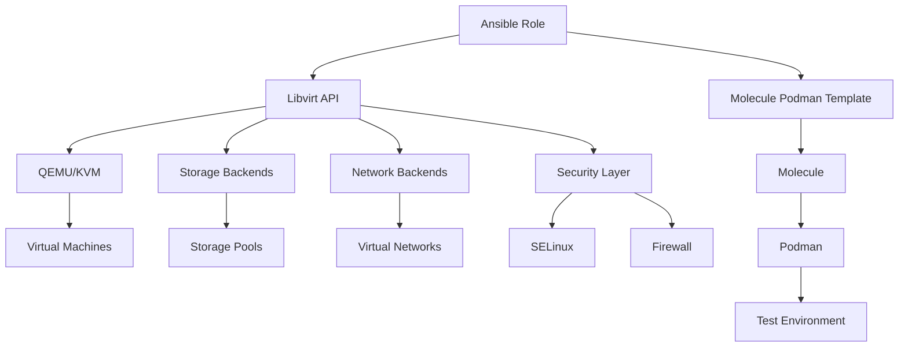

# Libvirt Role Overview

## Introduction

This repository contains two main components: an Ansible role for managing libvirt-based virtualization environments (`ansible-role-libvirt`) and a Molecule Podman template for testing Ansible roles (`molecule-podman-template`). The Libvirt Role automates the management of virtual machines, networks, and storage pools, while the Molecule Podman template provides a standardized way to test Ansible roles using Molecule and Podman. Together, these components provide a comprehensive solution for managing and testing libvirt-based infrastructure.

## Key Components

### Ansible Role for Libvirt (`ansible-role-libvirt`)

The `ansible-role-libvirt` is designed to automate the management of libvirt-based virtualization environments. It provides a comprehensive set of tools for configuring and managing virtual machines, networks, and storage pools in a consistent and repeatable manner.

#### Features

-   **Virtual Machine Management**: Create, configure, and manage virtual machines
-   **Network Configuration**: Define and manage virtual networks
-   **Storage Management**: Configure storage pools and volumes
-   **Security Integration**: SELinux and firewall configuration
-   **Performance Optimization**: CPU pinning, memory allocation, and disk I/O tuning
-   **Automation Framework**: Integration with Ansible and Molecule for testing

### Molecule Podman Template (`molecule-podman-template`)

The `molecule-podman-template` provides a standardized way to test Ansible roles using Molecule and Podman. It includes a set of pre-configured Molecule scenarios and a Dockerfile for building a test environment.

#### Features

-   **Standardized Testing**: Provides a consistent way to test Ansible roles
-   **Podman Integration**: Uses Podman as the container runtime for testing
-   **Pre-configured Scenarios**: Includes a default scenario for converging and verifying roles
-   **Easy to Use**: Simplifies the process of setting up and running Molecule tests

## Repository Architecture

### Core Components

1. **Libvirt Daemon**: Central management service
2. **QEMU/KVM**: Hypervisor for virtual machines
3. **Storage Backends**: Directory, LVM, iSCSI, NFS
4. **Network Backends**: NAT, routed, isolated networks
5. **Security Layer**: SELinux and firewall integration
6. **Ansible**: Automation tool used by the role
7. **Molecule**: Testing framework for Ansible roles
8. **Podman**: Container runtime used by Molecule for testing

### Component Relationships



## Usage

Refer to the [usage guide](usage.md) for detailed instructions on how to use the Ansible role and the Molecule Podman template.

## Testing

Refer to the [testing guide](testing.md) for information on how to test the Ansible role using the Molecule Podman template.

## Getting Started

### Quick Start

1. Install required packages:
```bash
sudo dnf install -y libvirt qemu-kvm virt-install virt-viewer
```

2. Clone the repository:
```bash
git clone https://github.com/your-org/ansible-role-libvirt.git
cd ansible-role-libvirt
```

3. Run the playbook:
```bash
ansible-playbook -i localhost, -c local playbooks/setup.yml
```

## Documentation Structure

- **README.md**: Project introduction and quick start guide
- **docs/overview.md**: High-level architecture and features (this document)
- **docs/usage.md**: Detailed usage instructions
- **docs/testing.md**: Testing and verification procedures
- **docs/api.md**: API reference and integration guide
- **docs/troubleshooting.md**: Common issues and solutions
- **docs/contributing.md**: Contribution guidelines

## License

This project is licensed under the MIT License - see the [LICENSE](LICENSE) file for details.

## Support

For support and feature requests, please open an issue on our [GitHub repository](https://github.com/your-org/ansible-role-libvirt/issues).

## Roadmap

### Upcoming Features
- Cloud-init integration
- GPU passthrough support
- Live migration capabilities
- Enhanced monitoring and metrics
- Backup and restore functionality

## Contributing

We welcome contributions! Please see our [CONTRIBUTING.md](docs/contributing.md) guide for details on how to get started.

## Code of Conduct

This project adheres to the Contributor Covenant [code of conduct](CODE_OF_CONDUCT.md). By participating, you are expected to uphold this code.
